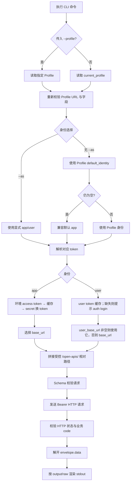
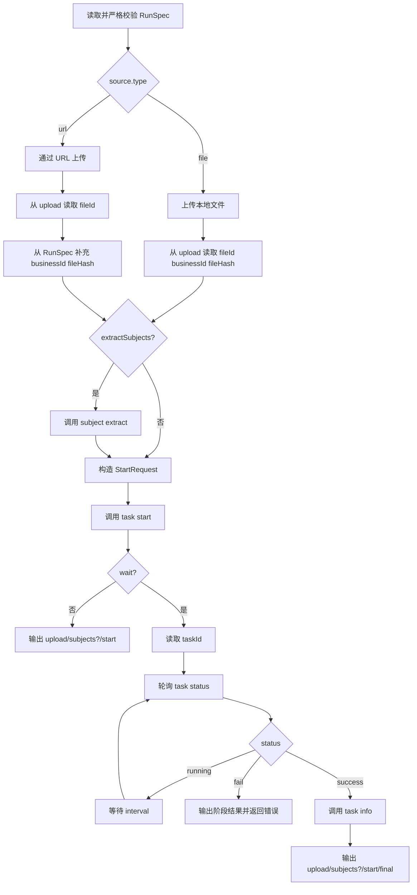

# everyline-cli Profile 模式：CLI 接口入参与响应

> 文档性质：目标态接口说明。目标是公开构建只内置 `prod` 环境，其他部署环境通过自定义 Profile 注入连接配置。
>
> 代码基线：`20260817-zss-everyline-cli` 分支，整理日期：2026-08-24。

## 1. 目标与边界

目标态采用以下规则：

1. `--env` 只接受公开的 `prod` 预设。
2. 其他环境创建 Profile 时不传 `--env`，必须显式提供 `--base-url` 和 `--token-url`。
3. Profile 负责选择 API 地址、身份和输出格式，不作为业务字段发送给服务端。
4. 所有业务命令通过公共参数 `--profile <name>` 选择 Profile；未传时使用 `config use` 选中的当前 Profile。
5. app secret、access token、OAuth code 和 PKCE verifier 不进入 Profile。

当前源码仍内置 `dev/test/blue/prod` 四个预设。本文描述的是删除非 prod 预设后的目标行为；自定义 Profile 的命令入口已经存在。

### 1.1 准确性边界

- 25 个远端 operation 的方法、路径和请求 Schema 已在源码中绑定。
- 远端成功响应统一解开 `data` 后输出。
- 除 CLI 本地组合响应外，当前仓库没有字段级 response schema。本文对远端响应标记为“透传 `data`”，只冻结工作流实际依赖的最小字段，不推测平台可能返回的其他字段。

## 2. Profile 数据模型

Profile 保存在 `~/.everyline-cli/config.json`。可以通过 `EVERYLINE_CONFIG_DIR` 修改配置目录；配置目录权限为 `0700`，Profile、token 和文件型 secret 文件权限为 `0600`。

| Profile 字段 | `config add` 参数 | 必填条件 | 用途 |
|---|---|---|---|
| `name` | 位置参数 `<name>` | 必填 | Profile 唯一名称；仅允许字母、数字、点、下划线、短横线 |
| `base_url` | `--base-url` | 自定义 Profile 必填 | app 业务 API 基址；user 未配置独立基址时也复用它 |
| `user_base_url` | `--user-base-url` | 可选 | user 身份业务 API 基址 |
| `auth_url` | `--auth-url` | 可选 | OAuth 配置缺失时提供给用户的认证页面 |
| `token_url` | `--token-url` | 当前实现始终必填 | app tenant token 完整地址 |
| `app_id` | `--app-id` | 默认身份为 app 时必填 | 非敏感 app ID；也可在登录时由 flag/环境变量覆盖 |
| `oauth_metadata_url` | `--oauth-metadata-url` | user OAuth 登录时必填 | OAuth authorization server metadata URL |
| `oauth_business_type` | `--oauth-business-type` | user OAuth 登录时必填 | OAuth 业务类型 |
| `oauth_client_id` | `--oauth-client-id` | user OAuth 登录时必填 | public client ID |
| `oauth_redirect_url` | `--oauth-redirect-url` | user OAuth 登录时必填 | 本机 loopback callback；当前应使用 HTTP |
| `oauth_scopes` | `--oauth-scope` | 可选 | OAuth scope；参数可重复或使用逗号分隔 |
| `default_identity` | `--default-identity` | 可选，默认 `app` | `app` 或 `user` |
| `default_output` | `--default-output` | 可选，默认 `json` | `json`、`yaml`、`table` 或 `raw`；显式值保持不变 |

远端 URL 必须使用 HTTPS；仅 `localhost`、`127.0.0.0/8` 和 `::1` 等 loopback 地址允许 HTTP。`base-url` 不允许包含 query 或 fragment。

### 2.1 prod 预设 Profile

```bash
everyline-cli config add prod-user \
  --env prod \
  --default-identity user \
  --default-output json
```

目标态中 `--env test`、`--env dev`、`--env blue` 等输入应返回参数错误，不在二进制或公开文档内包含对应地址。

### 2.2 自定义 app Profile

```bash
everyline-cli config add custom-app \
  --base-url 'https://<OPEN_PLATFORM_HOST>' \
  --token-url 'https://<OPEN_PLATFORM_HOST>/open-apis/auth/v3/tenant_access_token/internal' \
  --app-id '<APP_ID>' \
  --default-identity app \
  --default-output json
```

登录时注入 secret：

```bash
printf '%s' "$EVERYLINE_APP_SECRET" | \
  everyline-cli auth login \
    --profile custom-app \
    --as app \
    --app-secret-stdin \
    --output json
```

### 2.3 自定义 user Profile

```bash
everyline-cli config add custom-user \
  --base-url 'https://<OPEN_PLATFORM_HOST>' \
  --user-base-url 'https://<USER_API_HOST>' \
  --token-url 'https://<OPEN_PLATFORM_HOST>/open-apis/auth/v3/tenant_access_token/internal' \
  --auth-url 'https://<LOGIN_PAGE_HOST>' \
  --oauth-metadata-url 'https://<ACCOUNT_HOST>/.well-known/oauth-authorization-server/<BUSINESS_TYPE>' \
  --oauth-business-type '<BUSINESS_TYPE>' \
  --oauth-client-id '<PUBLIC_CLIENT_ID>' \
  --oauth-redirect-url 'http://127.0.0.1:8765/callback' \
  --oauth-scope 'cli:tools' \
  --oauth-scope 'cli:resources' \
  --default-identity user \
  --default-output json
```

当前实现即使只使用 user 身份，也要求 `--token-url`。若产品目标允许纯 user Profile，应另行决定是否放宽这一约束。

### 2.4 当前四套环境配置

以下内容按当前源码 `internal/config/environment.go` 整理。迁移到目标态后，只有 `prod` 保留为 `--env` 预设；`dev`、`test`、`blue` 使用本节参数创建自定义 Profile。

| Profile 字段 | dev | test | blue | prod |
|---|---|---|---|---|
| `base_url` | `https://dev-open.qtech.cn` | `https://test-open.qtech.cn` | `https://blue-open.qtech.cn` | `https://open.qfei.cn` |
| `user_base_url` | 未单独配置，复用 `base_url` | 未单独配置，复用 `base_url` | 未单独配置，复用 `base_url` | 未单独配置，复用 `base_url` |
| `auth_url` | `https://dev-contract-agent.qtech.cn` | `https://test-contract-agent.qtech.cn` | `https://blue-contract-agent.qtech.cn` | `https://contract-agent.qfei.cn` |
| `token_url` | `https://dev-open.qtech.cn/open-apis/auth/v3/tenant_access_token/internal` | `https://test-open.qtech.cn/open-apis/auth/v3/tenant_access_token/internal` | `https://blue-open.qtech.cn/open-apis/auth/v3/tenant_access_token/internal` | `https://open.qfei.cn/open-apis/auth/v3/tenant_access_token/internal` |
| `oauth_metadata_url` | `https://dev-myaccount.qtech.cn/.well-known/oauth-authorization-server/contract-review` | `https://test-myaccount.qtech.cn/.well-known/oauth-authorization-server/contract-review` | 当前未配置 | 当前未配置 |
| `oauth_business_type` | `contract-review` | `contract-review` | 当前未配置 | 当前未配置 |
| `oauth_client_id` | `zscli_a9f2a3ce87fa5bb6` | `zscli_a94c9aa398389bd7` | 当前未配置 | 当前未配置 |
| `oauth_redirect_url` | `http://127.0.0.1:8000/login` | `http://127.0.0.1:8000/login` | 当前未配置 | 当前未配置 |
| `oauth_scopes` | `contract-review:full` | `contract-review:full` | 当前未配置 | 当前未配置 |

#### dev user Profile

```bash
everyline-cli config add dev-user \
  --base-url 'https://dev-open.qtech.cn' \
  --token-url 'https://dev-open.qtech.cn/open-apis/auth/v3/tenant_access_token/internal' \
  --auth-url 'https://dev-contract-agent.qtech.cn' \
  --oauth-metadata-url 'https://dev-myaccount.qtech.cn/.well-known/oauth-authorization-server/contract-review' \
  --oauth-business-type 'contract-review' \
  --oauth-client-id 'zscli_a9f2a3ce87fa5bb6' \
  --oauth-redirect-url 'http://127.0.0.1:8000/login' \
  --oauth-scope 'contract-review:full' \
  --default-identity user \
  --default-output json
```

#### test user Profile

```bash
everyline-cli config add test-user \
  --base-url 'https://test-open.qtech.cn' \
  --token-url 'https://test-open.qtech.cn/open-apis/auth/v3/tenant_access_token/internal' \
  --auth-url 'https://test-contract-agent.qtech.cn' \
  --oauth-metadata-url 'https://test-myaccount.qtech.cn/.well-known/oauth-authorization-server/contract-review' \
  --oauth-business-type 'contract-review' \
  --oauth-client-id 'zscli_a94c9aa398389bd7' \
  --oauth-redirect-url 'http://127.0.0.1:8000/login' \
  --oauth-scope 'contract-review:full' \
  --default-identity user \
  --default-output json
```

#### blue app Profile

```bash
everyline-cli config add blue-app \
  --base-url 'https://blue-open.qtech.cn' \
  --token-url 'https://blue-open.qtech.cn/open-apis/auth/v3/tenant_access_token/internal' \
  --auth-url 'https://blue-contract-agent.qtech.cn' \
  --app-id '<BLUE_APP_ID>' \
  --default-identity app \
  --default-output json
```

blue 当前没有内置 OAuth metadata、business type、public client ID、redirect URL 或 scope。配置这些字段前需要由对应环境提供确认值。

#### prod Profile

prod 可以继续使用预设：

```bash
everyline-cli config add prod-app \
  --env prod \
  --app-id '<PROD_APP_ID>' \
  --default-identity app \
  --default-output json
```

等价的显式连接配置为：

```bash
everyline-cli config add prod-app-explicit \
  --base-url 'https://open.qfei.cn' \
  --token-url 'https://open.qfei.cn/open-apis/auth/v3/tenant_access_token/internal' \
  --auth-url 'https://contract-agent.qfei.cn' \
  --app-id '<PROD_APP_ID>' \
  --default-identity app \
  --default-output json
```

prod 当前也没有内置 user OAuth 参数；使用 user 身份前需要补充 `--oauth-*` 配置。

## 3. Profile 解析与请求流程



Profile 只影响 C 到 Q 的本地路由和鉴权过程；服务端业务请求体中没有 `profile` 或环境名字段。

## 4. CLI 公共契约

### 4.1 公共参数

| 参数 | 默认值 | 行为 |
|---|---:|---|
| `--profile <name>` | 当前 Profile | 仅覆盖本次命令 |
| `--as app\|user` | Profile 默认身份，再回退 app | 仅覆盖本次命令 |
| `--output json\|yaml\|table\|raw` | Profile 默认输出，再回退 json | 控制 stdout 格式 |
| `--raw` | `false` | 等价于 `--output raw`，输出紧凑 JSON，不是原始 HTTP envelope |
| `--timeout <duration>` | `30s` | 单次业务操作总预算，包含取 token、重试和退避 |
| `--verbose` | `false` | 将进度写入 stderr，不污染 stdout |
| `--no-color` | `false` | 禁用彩色输出 |

相关环境变量：

| 环境变量 | 用途 |
|---|---|
| `EVERYLINE_CONFIG_DIR` | 覆盖默认的 `~/.everyline-cli` 配置目录 |
| `EVERYLINE_ACCESS_TOKEN` | 覆盖 app access token；不用于 user 身份 |
| `EVERYLINE_APP_ID` | 通用 app ID |
| `EVERYLINE_APP_SECRET` | 通用 app secret |
| `EVERYLINE_APP_ID_<PROFILE_KEY>` | 指定 Profile 的 app ID，优先于通用变量和 Profile 文件 |
| `EVERYLINE_APP_SECRET_<PROFILE_KEY>` | 指定 Profile 的 app secret，优先于通用变量和本地安全存储 |
| `EVERYLINE_CLI_WRAPPER=1` | npm/npx 包装器内部标记；禁止自更新包内二进制 |

`PROFILE_KEY` 对常见小写字母转为大写，数字保持不变，符号和原始大写字符编码为 `_XX` 十六进制。例如 `custom-app` 对应 `CUSTOM_2DAPP`。

### 4.2 JSON 输入

复杂请求使用以下二选一输入：

```text
--input request.json
--data '{...}'
```

约束：

- 必须且只能提供一个来源。
- 最大 2 MiB。
- 只允许一个顶层 JSON 值。
- 使用严格字段解码；未知字段直接报错。
- ID 批量删除允许重复 `--id`，或通过 `--input/--data` 提供 JSON 字符串数组，两种来源不能同时使用。

### 4.3 dry-run

写命令的 `--dry-run` 和 `--print-input` 当前行为一致：完成本地解析、规范化和 Schema 校验，以 JSON 输出最终逻辑请求，不读取 Profile、不获取 token、不发送 HTTP。

实际删除操作要求 `--yes`；dry-run 在发送前结束，因此不要求 `--yes`。

### 4.4 HTTP 请求与响应

业务请求公共头：

```http
Accept: application/json
Authorization: Bearer <TOKEN>
User-Agent: everyline-cli
```

平台成功响应 envelope：

```json
{
  "code": 200,
  "msg": "success",
  "data": {}
}
```

app token 接口成功码为 `0`；其余当前业务 operation 成功码为 `200`。CLI 校验成功码后只输出 `data`。清单和规则服务允许 `data` 为对象、数组或标量；审查服务要求 `data` 为对象。

GET 请求在网络错误、HTTP 429 或 5xx 时最多尝试 3 次；写请求不自动重试。

## 5. 本地管理命令

这些命令不属于业务 API operation；其中 `auth login --as app` 和 user OAuth 登录会调用鉴权端点。

### 5.1 Profile 命令

| CLI 命令 | 入参 | stdout 响应 |
|---|---|---|
| `config add <name>` | `--env prod`，或 `--base-url` + `--token-url`；其余见 Profile 字段表 | 完整非敏感 Profile 对象 |
| `config list` | 无 | Profile 摘要数组：`name/current/base_url/user_base_url/auth_url/token_url/app_id/default_identity/default_output` |
| `config use <name>` | Profile 名称 | `{"profile":"<name>","current":true}` |
| `config show [name]` | 位置参数、公共 `--profile` 或当前 Profile | 完整非敏感 Profile 对象 |

`config add` 覆盖同名 Profile 时，如果连接地址、app ID 或 OAuth 配置发生变化，会删除该 Profile 的 app/user token 缓存。

### 5.2 鉴权命令

| CLI 命令 | 入参 | 远端调用 | stdout 响应 |
|---|---|---|---|
| `auth login --as app` | `--app-id`、`--app-secret` 或 `--app-secret-stdin`、可选 `--save-app-secret` | `POST profile.token_url` | `profile`、`identity`、`authenticated=true`、可选 `expiresAt` |
| `auth login --as user` | 可选 `--no-open-browser`；OAuth 参数来自 Profile | metadata discovery、authorization endpoint、token endpoint | 与 app 登录相同，不输出 token |
| `auth status` | 公共 `--profile`、`--as` | 无 | 鉴权状态对象，见下表 |
| `auth use [profile] --as app\|user` | Profile 位置参数或当前 Profile | 无 | `{"profile":"...","identity":"app|user"}` |
| `auth logout` | 公共 `--profile`、`--as` | 无 | `{"profile":"...","identity":"...","authenticated":false}` |

app token 请求：

```json
{
  "appId": "<APP_ID>",
  "appSecret": "<APP_SECRET>"
}
```

app token 响应最小要求：

```json
{
  "code": 0,
  "msg": "success",
  "tenant_access_token": "<TOKEN>",
  "expire": 7200
}
```

user OAuth 使用 Profile 中的动态端点，不计入固定的 25 个 operation：

1. `GET oauth_metadata_url`，响应至少包含：

   ```json
   {
     "authorization_endpoint": "https://<ACCOUNT_HOST>/authorize",
     "token_endpoint": "https://<ACCOUNT_HOST>/token",
     "code_challenge_methods_supported": ["S256"]
   }
   ```

2. 浏览器 authorization 请求 query：

   | 参数 | 来源 |
   |---|---|
   | `business_type` | `oauth_business_type` |
   | `client_id` | `oauth_client_id` |
   | `redirect_uri` | `oauth_redirect_url` |
   | `scope` | `oauth_scopes` 以空格连接 |
   | `response_type` | 固定 `code` |
   | `code_challenge_method` | 固定 `S256` |
   | `code_challenge` | CLI 临时生成 |
   | `state` | CLI 临时生成并在 callback 校验 |

3. `POST token_endpoint`，Content-Type 为 `application/x-www-form-urlencoded`：

   ```text
   client_id=<PUBLIC_CLIENT_ID>
   code=<AUTHORIZATION_CODE>
   code_verifier=<PKCE_VERIFIER>
   grant_type=authorization_code
   redirect_uri=http://127.0.0.1:<PORT>/<PATH>
   ```

4. OAuth token 响应：

   ```json
   {
     "access_token": "<TOKEN>",
     "token_type": "Bearer",
     "expires_in": 7200,
     "refresh_token": "<OPTIONAL_REFRESH_TOKEN>",
     "scope": "cli:tools cli:resources"
   }
   ```

CLI 缓存 token，但 stdout 仍只输出登录状态对象。当前不会自动使用 `refresh_token`，过期后需重新登录。

`auth status` 字段：

| 字段 | 条件 | 含义 |
|---|---|---|
| `profile` | 始终 | Profile 名称 |
| `identity` | 始终 | `app` 或 `user` |
| `authenticated` | 始终 | 当前凭证是否可用 |
| `source` | 始终 | `environment` 或 `cache` |
| `expiresKnown` | access token 存在时 | 是否知道过期时间 |
| `expiresAt` | 已知过期时间 | RFC 3339 时间 |
| `expiresInSeconds` | 已知过期时间 | 非负剩余秒数 |
| `appSecretConfigured` | app 身份 | 是否存在环境变量或本地安全存储 secret；不输出 secret |
| `authURL` | user 未登录且 Profile 配置了页面 | 认证页面提示 |

凭证来源优先级：

- app ID：`--app-id` → Profile 专用环境变量 → `EVERYLINE_APP_ID` → Profile。
- app secret：`--app-secret` → stdin → Profile 专用环境变量 → `EVERYLINE_APP_SECRET` → 本地安全存储。
- app access token：`EVERYLINE_ACCESS_TOKEN` → token 缓存 → app secret 换取。
- user access token：user 专用 token 缓存；过期或缺失时重新执行浏览器 OAuth。

### 5.3 版本、更新与 completion

| CLI 命令 | 入参 | 响应 |
|---|---|---|
| `version` | 可选 `--manifest-url HTTPS_URL` | `version/commit/date/latestVersion/isLatest/updateCommand/checkError?` |
| `update` | 可选 `--manifest-url HTTPS_URL`、`--dry-run`；也可使用环境变量或发布构建内置地址 | `currentVersion/latestVersion/platform/updated/scheduled/dryRun` |
| `completion bash\|fish\|powershell\|zsh` | shell 名称 | 对应 shell completion 脚本文本 |

更新 manifest：

```json
{
  "version": "1.2.3",
  "platforms": {
    "darwin-arm64": {
      "url": "https://<HOST>/everyline-cli",
      "sha256": "<64_HEX>"
    }
  }
}
```

`update` 与业务 Profile 独立，不读取 `base_url` 或业务 token。

## 6. 远端 operation 总表

下表中的路径拼接到选中身份对应的 Profile 基址。实际成功 stdout 均为远端 envelope 的 `data`，除非“响应”列明确说明为 CLI 本地组合结果。

| # | CLI 命令 | Operation ID | 方法与路径 | 逻辑入参 | 响应 |
|---:|---|---|---|---|---|
| 1 | `auth login --as app` | `tenantAccessTokenInternal` | `POST profile.token_url` | `appId/appSecret` | CLI 登录状态对象 |
| 2 | `review file upload` | `uploadContractFileV3` | `POST /open-apis/contract-review/v3/file/contract/upload` | multipart `file/name` | 对象；工作流依赖 `fileId/businessId/fileHash` |
| 3 | `review file upload-url` | `uploadContractFileByURLV3` | `POST /open-apis/contract-review/v1/file/contract/uploadByUrl` | `fileUrl/fileName` | 对象；至少可读取 `fileId` |
| 4 | `review subject extract` | `smartAuditContractSubjects` | `POST /open-apis/contract-review/v3/smartAudit/contract/subjects` | `businessId/fileId/fileHash?` | 主体信息对象，字段透传 |
| 5 | `review task start` | `smartAuditTaskStartReview` | `POST /open-apis/contract-review/v3/smartAudit/task/startReview` | Start body + 固定 `usageReportContext` | 对象；等待流程依赖 `taskId` |
| 6 | `review task status` | `smartAuditTaskStatus` | `GET /open-apis/contract-review/v3/smartAudit/task/status` | Task query | 对象；轮询依赖 `status/message?` |
| 7 | `review task info` | `smartAuditTaskInfo` | `GET /open-apis/contract-review/v3/smartAudit/task/info` | Task query | 完整详情对象，字段透传 |
| 8 | `checklist create` | `createReviewChecklist` | `POST /open-apis/review-rules/review-checklists` | Checklist | `data` 原形透传 |
| 9 | `checklist batch-create` | `batchCreateReviewChecklists` | `POST /open-apis/review-rules/review-checklists/batch` | Checklist[] | `data` 原形透传 |
| 10 | `checklist list` | `listReviewChecklists` | `GET /open-apis/review-rules/review-checklists` | Checklist query | `data` 原形透传 |
| 11 | `checklist update` | `updateReviewChecklist` | `PUT /open-apis/review-rules/review-checklists/{id}` | path `id` + Checklist | `data` 原形透传 |
| 12 | `checklist batch-update` | `batchUpdateReviewChecklists` | `PUT /open-apis/review-rules/review-checklists/batch` | Checklist[]，每项含 `id` | `data` 原形透传 |
| 13 | `checklist delete` | `deleteReviewChecklist` | `DELETE /open-apis/review-rules/review-checklists/{id}` | path `id` | `data` 原形透传 |
| 14 | `checklist batch-delete` | `batchDeleteReviewChecklists` | `DELETE /open-apis/review-rules/review-checklists/batch` | `{"ids":[]}` | `data` 原形透传 |
| 15 | `rule group create` | `createReviewRuleGroup` | `POST /open-apis/review-rules/review-rule-groups` | Group | `data` 原形透传 |
| 16 | `rule group list` | `listReviewRuleGroups` | `GET /open-apis/review-rules/review-rule-groups` | Rule query | `data` 原形透传 |
| 17 | `rule group update` | `updateReviewRuleGroup` | `PUT /open-apis/review-rules/review-rule-groups/{id}` | path `id` + Group | `data` 原形透传 |
| 18 | `rule group delete` | `deleteReviewRuleGroup` | `DELETE /open-apis/review-rules/review-rule-groups/{id}` | path `id` | `data` 原形透传 |
| 19 | `rule create` | `createReviewRule` | `POST /open-apis/review-rules/review-rule-groups/{groupId}/rules` | path `groupId` + Rule | `data` 原形透传 |
| 20 | `rule batch-create` | `batchCreateReviewRules` | `POST /open-apis/review-rules/review-rule-groups/{groupId}/rules/batch` | path `groupId` + Rule[] | `data` 原形透传 |
| 21 | `rule list` | `listReviewRules` | `GET /open-apis/review-rules/review-rule-groups/{groupId}/rules` | path `groupId` + Rule query | `data` 原形透传 |
| 22 | `rule update` | `updateReviewRule` | `PUT /open-apis/review-rules/review-rule-groups/{groupId}/rules/{ruleId}` | path IDs + Rule | `data` 原形透传 |
| 23 | `rule batch-update` | `batchUpdateReviewRules` | `PUT /open-apis/review-rules/review-rule-groups/{groupId}/rules/batch` | path `groupId` + Rule[]，每项含 `id` | `data` 原形透传 |
| 24 | `rule delete` | `deleteReviewRule` | `DELETE /open-apis/review-rules/review-rule-groups/{groupId}/rules/{ruleId}` | path IDs | `data` 原形透传 |
| 25 | `rule batch-delete` | `batchDeleteReviewRules` | `DELETE /open-apis/review-rules/review-rule-groups/{groupId}/rules/batch` | path `groupId` + `{"ids":[]}` | `data` 原形透传 |

`review task result` 和 `review run` 是 CLI 本地编排，不增加远端 operation。

## 7. Review 接口

### 7.1 本地文件上传

```bash
everyline-cli review file upload \
  --profile custom-user \
  --as user \
  --file ./contract.pdf \
  --name '合同.pdf' \
  --output json
```

| CLI 参数 | HTTP 字段 | 必填 | 约束 |
|---|---|---|---|
| `--file` | multipart `file` | 是 | 普通文件，最大 2 MiB |
| `--name` | multipart `name` | 是 | 以 `.doc`、`.docx` 或 `.pdf` 结尾 |

dry-run 响应：

```json
{"file":"./contract.pdf","name":"合同.pdf"}
```

实际响应透传对象；完整工作流使用以下最小字段：

```json
{
  "fileId": 11,
  "businessId": "biz-1",
  "fileHash": "<64_HEX_SHA256>"
}
```

### 7.2 URL 文件上传

```bash
everyline-cli review file upload-url \
  --file-url 'https://<HOST>/contract.pdf' \
  --name '合同.pdf'
```

请求：

```json
{"fileUrl":"https://<HOST>/contract.pdf","fileName":"合同.pdf"}
```

响应为透传对象。URL 上传链路只保证可读取 `fileId`；一键工作流还要求调用方在 RunSpec 中提供 `businessId` 和已知的 `fileHash`。

### 7.3 主体提取

```bash
everyline-cli review subject extract \
  --business-id biz-1 \
  --file-id 11 \
  --file-hash '<64_HEX_SHA256>'
```

请求：

```json
{
  "businessId": "biz-1",
  "fileId": "11",
  "fileHash": "<64_HEX_SHA256>"
}
```

`businessId`、`fileId` 必填，`fileHash` 可选。响应为主体信息对象，CLI 保留全部服务端字段。交互审查流程使用同一 `counterparts[]` 候选的 `name` 和 `role`：

```json
{
  "counterparts": [
    {"name": "xxx公司", "role": "甲方"},
    {"name": "yyy公司", "role": "乙方"}
  ]
}
```

其中 `name` 写入 `config.selectedPosition`，同一候选的 `role` 写入 `config.selectedAuditRole`；候选缺少任一字段时，交互 Skill 停止发起任务。

### 7.4 发起审查任务

CLI 输入中 `fileId` 是正整数；HTTP 边界转换为十进制字符串，并固定补入 `usageReportContext.reportBusinessCode=everyLine_100_openApi_cli`。该上下文不是 CLI 输入字段，也不能通过 Profile 或 JSON 覆盖。

```json
{
  "businessId": "biz-1",
  "fileId": 11,
  "fileHash": "<64_HEX_SHA256>",
  "config": {
    "selectedPosition": "xxx公司",
    "selectedAuditRole": "甲方",
    "reviewStrength": "中立",
    "selectedCheckListIds": ["check-1"],
    "matchContractTypeRulePackage": true
  }
}
```

| 字段 | 类型 | 必填 | 约束 |
|---|---|---|---|
| `businessId` | string | 是 | 非空 |
| `fileId` | integer | 是 | 大于 0；HTTP 中发送为 string |
| `fileHash` | string | 是 | 64 位 SHA-256 十六进制 |
| `config.selectedPosition` | string | 是 | 合同主体精确名称，非空 |
| `config.selectedAuditRole` | string | 是 | 同一主体的角色，例如甲方或乙方，非空 |
| `config.reviewStrength` | string 或 integer | 是 | 推荐 `弱势`、`中立`、`强势`，兼容旧版 `0/1/2`；HTTP 统一发送 `0/1/2` |
| `config.selectedCheckListIds` | string[] | 条件必填 | 非空数组，每项非空 |
| `config.matchContractTypeRulePackage` | boolean | 条件必填 | 仅 `true` 构成有效规则来源 |
| `usageReportContext.reportBusinessCode` | string | CLI 固定 | `everyLine_100_openApi_cli` |

实际 HTTP 请求固定包含：

```json
{
  "usageReportContext": {
    "reportBusinessCode": "everyLine_100_openApi_cli"
  }
}
```

`selectedCheckListIds` 非空或 `matchContractTypeRulePackage=true` 至少满足一项；两项同时提供时组合执行，互不覆盖且没有优先级。响应为任务对象；`review run` 的等待链路要求响应包含正整数 `taskId`。

### 7.5 任务查询

`status`、`info` 和 `result` 共用参数：

| CLI 参数 | Query 参数 | 必填 | 约束 |
|---|---|---|---|
| `--task-id` | `taskId` | 是 | 正整数 |
| `--business-id` | `businessId` | 条件必填 | `visibilityScope=contractResult` 时必填 |
| `--visibility-scope` | `visibilityScope` | 否 | 仅支持 `contractResult` |

`status` 响应为一次状态快照。轮询器识别：

- `status=running`：继续轮询。
- `status=success`：调用 `info` 获取详情。
- `status=fail`：返回任务失败；可选读取 `message`。
- 空状态：任务不存在或无权访问。
- 其他值：未知状态错误。

`info` 响应为完整任务详情对象，CLI 不裁剪字段。

`result` 额外支持 `--interval`（默认 `2s`）和 `--deadline`（默认 `10m`）。stdout 输出最终 `info.data`，后端提供顶层 `url` 时规范化为 `reviewDetailUrl`；每次状态写入 stderr。飞书用户 OAuth 响应没有预览链接时仍返回完整成功详情。

### 7.6 一键 review run

文件来源输入：

```json
{
  "source": {
    "type": "file",
    "path": "./contract.pdf",
    "name": "合同.pdf"
  },
  "config": {
    "selectedPosition": "xxx公司",
    "selectedAuditRole": "甲方",
    "reviewStrength": "中立",
    "matchContractTypeRulePackage": true
  },
  "extractSubjects": true,
  "wait": true
}
```

URL 来源输入：

```json
{
  "source": {
    "type": "url",
    "fileUrl": "https://<HOST>/contract.pdf",
    "name": "合同.pdf"
  },
  "businessId": "biz-1",
  "fileHash": "<64_HEX_SHA256>",
  "config": {
    "selectedPosition": "xxx公司",
    "selectedAuditRole": "甲方",
    "reviewStrength": "中立",
    "matchContractTypeRulePackage": true
  },
  "wait": true
}
```

组合响应：

```json
{
  "upload": {},
  "subjects": {},
  "start": {},
  "final": {}
}
```

`subjects` 仅在 `extractSubjects=true` 时出现；`final` 仅在 `wait=true` 且成功获取详情时出现。



## 8. Checklist 接口

### 8.1 请求模型

```json
{
  "id": "check-1",
  "name": "付款条款清单",
  "contractCategory": ["采购合同"],
  "reviewStage": [1],
  "enabled": true,
  "reviewRuleIds": ["rule-1"]
}
```

| 字段 | 类型 | 创建/单项更新 | 批量更新 | 约束 |
|---|---|---|---|---|
| `id` | string | 可选；单项更新以路径 `--id` 为准 | 必填 | 非空；若单项 body 提供，必须与路径 ID 一致 |
| `name` | string | 必填 | 必填 | 非空 |
| `contractCategory` | string[] | 可选 | 可选 | 非空数组 |
| `reviewStage` | integer[] | 可选 | 可选 | 非空数组 |
| `enabled` | boolean | 可选 | 可选 | `false` 会被保留 |
| `reviewRuleIds` | string[] | 必填 | 必填 | 至少一个非空 ID |

### 8.2 列表 Query

| CLI 参数 | Query 参数 | 类型/约束 |
|---|---|---|
| `--name` | `name` | string |
| `--review-stage` | 重复 `reviewStages` | string[] |
| `--contract-category` | 重复 `contractCategories` | string[] |
| `--start-time` | `startTime` | Unix 毫秒，非负 |
| `--end-time` | `endTime` | Unix 毫秒，非负且不早于 start |
| `--enabled` | `enabled` | 只有显式传 flag 才发送 |
| `--create-employee-id` | 重复 `createEmployeeIds` | string[] |
| `--update-employee-id` | 重复 `updateEmployeeIds` | string[] |
| `--sort` | 重复 `sort` | `property,(asc|desc)` |
| `--page-index` | `pageIndex` | 大于 0 时发送 |
| `--page-size` | `pageSize` | 大于 0 时发送 |

### 8.3 命令输入和 dry-run 响应

| 命令 | 输入 | dry-run stdout | 实际调用 |
|---|---|---|---|
| `checklist create` | `--input/--data` Checklist | Checklist | 支持 |
| `checklist batch-create` | Checklist[] | Checklist[] | 支持，真实请求体为 Checklist[] |
| `checklist list` | Query flags | 不支持 dry-run | 支持 |
| `checklist update --id` | Checklist | `{"id":"...","data":{...}}`，data 移除 body id | 支持 |
| `checklist batch-update` | 每项含 id 的 Checklist[] | Checklist[] | 支持，真实请求体为 Checklist[] |
| `checklist delete --id` | 路径 ID | `{"id":"..."}` | 支持，实际执行需 `--yes` |
| `checklist batch-delete` | `--id` 或 JSON ID[] | `{"ids":[...]}` | 支持，实际执行需 `--yes` |

实际响应均为服务端 `data` 原形；当前没有 Checklist response schema。

## 9. Rule 接口

### 9.1 规则分组模型

```json
{
  "id": "group-1",
  "name": "付款规则",
  "sourceType": 0
}
```

| 字段 | 类型 | 要求 |
|---|---|---|
| `id` | string | 单项更新可选且必须与路径 ID 一致；其他单项写入不发送 body id |
| `name` | string | 必填、非空 |
| `sourceType` | integer | 可选、不能小于 0 |

### 9.2 规则模型

```json
{
  "id": "rule-1",
  "name": "付款期限",
  "riskLevel": 2,
  "riskTips": "付款期限过长",
  "content": "付款期限不得超过约定上限",
  "sourceType": 0
}
```

| 字段 | 类型 | 要求 |
|---|---|---|
| `id` | string | 批量更新必填；单项更新可选且必须与 `--rule-id` 一致 |
| `name` | string | 必填、非空 |
| `riskLevel` | integer | 必填、不能小于 0 |
| `riskTips` | string | 可选 |
| `content` | string | 必填、非空 |
| `sourceType` | integer | 可选、不能小于 0 |

规则分组和规则列表共用：`--sort`、`--page-index`、`--page-size`。规则 CRUD 还必须提供 `--group-id`。

### 9.3 命令输入和 dry-run 响应

| 命令 | 输入 | dry-run stdout | 实际调用 |
|---|---|---|---|
| `rule group create` | Group | Group | 支持 |
| `rule group list` | Query flags | 不支持 dry-run | 支持 |
| `rule group update --id` | Group | `{"id":"...","data":{...}}` | 支持 |
| `rule group delete --id` | 路径 ID | `{"id":"..."}` | 支持，需 `--yes`；服务端固定级联 |
| `rule create --group-id` | Rule | `{"groupId":"...","data":{...}}` | 支持 |
| `rule batch-create --group-id` | Rule[] | `{"groupId":"...","data":[...]}` | 支持，真实请求体为 Rule[] |
| `rule list --group-id` | Query flags | 不支持 dry-run | 支持 |
| `rule update --group-id --rule-id` | Rule | `{"groupId":"...","ruleId":"...","data":{...}}` | 支持 |
| `rule batch-update --group-id` | 每项含 id 的 Rule[] | `{"groupId":"...","data":[...]}` | 支持，真实请求体为 Rule[] |
| `rule delete --group-id --rule-id` | 路径 IDs | `{"groupId":"...","ruleId":"..."}` | 支持，需 `--yes` |
| `rule batch-delete --group-id` | `--id` 或 JSON ID[] | `{"groupId":"...","ids":[...]}` | 支持，需 `--yes`；HTTP body 仅发送 `ids` |

实际响应均为服务端 `data` 原形；当前没有 Group/Rule response schema。

## 10. 输出和错误

### 10.1 输出通道

- stdout：业务结果、dry-run 请求或本地管理命令结果。
- stderr：错误、OAuth 授权链接和 review result 轮询进度。
- token、app secret、OAuth code 和 verifier 不输出。

### 10.2 远端错误模型

CLI 内部保留：

```json
{
  "httpStatus": 400,
  "code": "<REMOTE_CODE>",
  "message": "<REMOTE_MESSAGE>",
  "requestId": "<REQUEST_ID>",
  "retryAfter": 0,
  "retryable": false
}
```

命令行错误以单行文本写入 stderr；不会把该对象作为成功 stdout 返回。

### 10.3 退出码

| 退出码 | 含义 |
|---:|---|
| `0` | 成功 |
| `2` | 参数、JSON 或本地输入校验失败 |
| `3` | Profile 不存在、未选择 Profile 或鉴权失败 |
| `4` | 远端 API、接口契约不匹配、能力未开放或审查任务失败 |
| `5` | 网络错误、取消、超时或轮询截止 |

## 11. 从多环境预设迁移到 Profile

| 原调用 | 目标调用 |
|---|---|
| `config add dev-user --env dev ...` | `config add dev-user --base-url ... --token-url ... --oauth-* ...` |
| `config add test-app --env test ...` | `config add test-app --base-url ... --token-url ... --app-id ...` |
| 业务命令不传 Profile，依赖当前环境 | CI/Agent 推荐始终显式 `--profile <name> --as <identity>` |

迁移不改变业务命令 JSON，也不改变 24 个业务 API 的 method/path。变化只发生在调用前的 Profile 解析、基址选择和凭证来源。

目标态代码与发布检查：

1. `environmentPresets` 只保留 `prod`。
2. `--env` 帮助和错误文本只声明 `prod`。
3. 保留“不传 `--env`，同时传 `--base-url`/`--token-url`”的自定义入口。
4. 删除公开文档、示例、测试 fixture 和构建产物中的非 prod 地址、OAuth metadata 与 client ID。
5. 增加测试：非 prod `--env` 被拒绝；自定义 app/user Profile 可创建；Profile 能正确路由业务请求。
6. 增加发布扫描：公开包和二进制中不得出现非 prod 主机名或内部 client ID。
7. 若需要把本文升级为严格 SDK 契约，为 24 个业务 operation 补齐 response schema；当前仅请求侧有 Schema。
