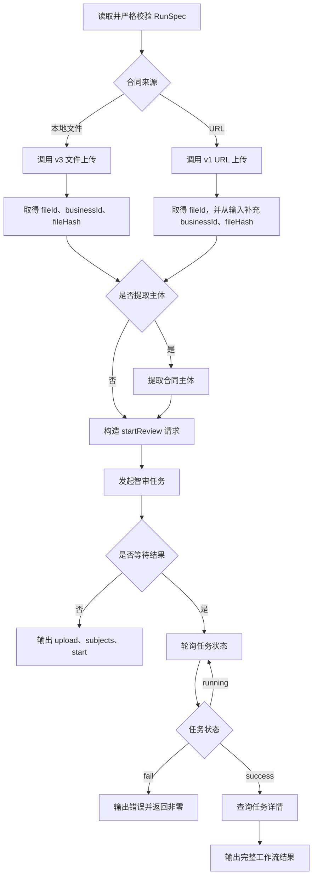

# 智书智审 CLI：让 Agent 真的会审合同

你的 AI Agent 能读合同、找风险、整理审查意见，但如果它进不了智审系统，就只能停在“帮你分析一下”。`everyline-cli` 把合同上传、主体提取、发起审查、结果查询、清单管理和规则管理变成稳定的命令，让 Agent、测试脚本和 CI 都能直接完成一条真实的智审流程。

> 当前基线：`test` 分支，核对日期 `2026-08-26`。
>
> 本文格式参照[智书合同 CLI 文档](https://ysi13ckdb9.feishu.cn/wiki/BosWwJsWfi5zK3kqtagctiwrnpf)，命令、字段、接口路径和行为以当前 `everyline-cli` 源码与 JSON Schema 为准。

## 它是什么

`everyline-cli` 是面向终端、自动化任务和 AI Agent 的智审开放平台命令行客户端。

| 组成部分 | 作用 | 适用场景 |
|---|---|---|
| `everyline-cli` | 把智审开放平台能力封装为结构化命令 | 人工终端、Agent 调用、自动化测试、CI |
| Profile | 保存环境地址、app ID、默认身份和输出格式 | 在 `dev`、`test`、`blue`、`prod` 或自定义环境之间切换 |
| app / user 身份 | 分别完成应用身份和个人身份认证 | 系统集成、个人操作、联调验收 |
| JSON / YAML / table / raw 输出 | 将业务结果稳定写入 stdout | Agent 解析、脚本编排、人工查看 |
| `review run` | 编排上传、主体提取、发起审查、轮询和取结果 | 一条命令完成合同审查 |

适用读者：

- 需要让 Agent 发起并跟踪合同审查的业务和研发人员。
- 需要覆盖 CLI 接口的测试和验收人员。
- 需要在 CI、脚本或服务集成中调用智审能力的开发者。
- 需要维护审查清单、规则分组和审查规则的管理员。

## 代码仓库

项目代码、JSON Schema、接口映射和构建脚本统一维护在 `everyline-cli` 仓库。内部开发和发布以 GitLab 分支及制品为准。

👉 获取代码：[everyline-cli](https://git.qtech.cn/ai/everyline-cli)

## 🚀 快速开始

### 1. 安装 CLI

你可以先让 Agent 执行安装：

```text
请帮我从 everyline-cli 的 test 分支完成源码安装，先运行测试和构建，
再把二进制安装到 ~/.local/bin，最后执行 version 验证。
```

手动从源码安装需要 Go `1.24+` 和 Node.js `18+`：

```bash
git clone https://git.qtech.cn/ai/everyline-cli.git everyline-cli
cd everyline-cli

git switch test
make test
make build

mkdir -p ~/.local/bin
install -m 755 bin/everyline-cli ~/.local/bin/everyline-cli
export PATH="$HOME/.local/bin:$PATH"

everyline-cli version --output json
```

建议将下面的 PATH 配置加入 `~/.zshrc` 或 `~/.bashrc`：

```bash
export PATH="$HOME/.local/bin:$PATH"
```

如果拿到发布制品 `everyline-cli-<版本>.tgz`，可以直接安装：

```bash
curl -fL '<TGZ_DOWNLOAD_URL>' -o 'everyline-cli-<版本>.tgz'
npm install -g './everyline-cli-<版本>.tgz'
everyline-cli version --output json
```

tgz 通常从 GitLab CI 的 `package` 制品或发布页面下载，包内包含 macOS、Linux、Windows 的 amd64/arm64 原生二进制。

### 2. 初始化本地 Profile

先让 Agent 创建一个 test 应用身份 Profile：

```text
请帮我为 everyline-cli 创建名为 test-app 的 test 环境 Profile，
默认使用 app 身份和 JSON 输出。appId 是 <TEST_APP_ID>。
```

手动执行：

```bash
everyline-cli config add test-app \
  --env test \
  --app-id '<TEST_APP_ID>' \
  --default-identity app \
  --default-output json
```

常用参数：

| 参数 | 含义 | 示例值 |
|---|---|---|
| Profile 名 | 本地配置名称，可按环境和身份命名 | `test-app` |
| `--env` | 使用内置环境预设 | `dev`、`test`、`blue`、`prod` |
| `--app-id` | 应用身份的 app ID | `<TEST_APP_ID>` |
| `--default-identity` | 默认调用身份 | `app` 或 `user` |
| `--default-output` | 默认输出格式 | `json` |

当前代码内置四套环境：

| 环境 | Base URL | Token URL | Auth URL |
|---|---|---|---|
| `dev` | `https://dev-open.qtech.cn` | `https://dev-open.qtech.cn/open-apis/auth/v3/tenant_access_token/internal` | `https://dev-contract-agent.qtech.cn` |
| `test` | `https://test-open.qtech.cn` | `https://test-open.qtech.cn/open-apis/auth/v3/tenant_access_token/internal` | `https://test-contract-agent.qtech.cn` |
| `blue` | `https://blue-open.qtech.cn` | `https://blue-open.qtech.cn/open-apis/auth/v3/tenant_access_token/internal` | `https://blue-contract-agent.qtech.cn` |
| `prod` | `https://open.qfei.cn` | `https://open.qfei.cn/open-apis/auth/v3/tenant_access_token/internal` | `https://contract-agent.qfei.cn` |

dev/test 还内置了 user OAuth 配置：

| 配置 | dev | test |
|---|---|---|
| OAuth metadata | `https://dev-myaccount.qtech.cn/.well-known/oauth-authorization-server/contract-review` | `https://test-myaccount.qtech.cn/.well-known/oauth-authorization-server/contract-review` |
| business type | `contract-review` | `contract-review` |
| public client ID | `zscli_a9f2a3ce87fa5bb6` | `zscli_a94c9aa398389bd7` |
| redirect URL | `http://127.0.0.1:8000/login` | `http://127.0.0.1:8000/login` |
| scope | `contract-review:full` | `contract-review:full` |

blue/prod 当前未内置 user OAuth metadata、public client ID、redirect URL 和 scope。需要使用 user 身份时，由对应环境提供这些参数后显式注入。

其他内置环境的 app Profile：

```bash
everyline-cli config add dev-app  --env dev  --app-id '<DEV_APP_ID>'  --default-identity app --default-output json
everyline-cli config add blue-app --env blue --app-id '<BLUE_APP_ID>' --default-identity app --default-output json
everyline-cli config add prod-app --env prod --app-id '<PROD_APP_ID>' --default-identity app --default-output json
```

不使用内置预设时，可以通过自定义 Profile 注入全部连接参数：

```bash
everyline-cli config add custom-app \
  --base-url 'https://<OPEN_PLATFORM_HOST>' \
  --token-url 'https://<OPEN_PLATFORM_HOST>/open-apis/auth/v3/tenant_access_token/internal' \
  --auth-url 'https://<CONTRACT_AGENT_HOST>' \
  --app-id '<APP_ID>' \
  --default-identity app \
  --default-output json
```

自定义 user Profile 可增加 `--user-base-url`，并通过 `--oauth-metadata-url`、`--oauth-business-type`、`--oauth-client-id`、`--oauth-redirect-url`、`--oauth-scope` 注入 OAuth 配置。

Profile 默认保存在 `~/.everyline-cli/config.json`，可通过 `EVERYLINE_CONFIG_DIR` 修改目录。Profile 不保存 access token、OAuth code 或未显式保存的 app secret。

### 3. 完成授权

| 授权方式 | 适用场景 | 身份参数 |
|---|---|---|
| app secret 换取 token | 系统集成、CI、自动化任务 | `--as app` |
| OAuth/PKCE 浏览器授权 | 个人身份操作 | `--as user` |

app 身份推荐通过 stdin 传递 secret：

```bash
export EVERYLINE_APP_SECRET='<APP_SECRET>'

printf '%s' "$EVERYLINE_APP_SECRET" | \
  everyline-cli auth login \
    --profile test-app \
    --as app \
    --app-secret-stdin \
    --output json
```

user 身份授权：

```bash
everyline-cli config add test-user \
  --env test \
  --default-identity user \
  --default-output json

everyline-cli auth login \
  --profile test-user \
  --as user \
  --timeout 3m
```

CLI 会打开浏览器完成 OAuth/PKCE 授权，并通过本机 loopback 回调接收结果。增加 `--no-open-browser` 时只输出授权链接。

⚠️ 不要把 app secret、access token 或 OAuth code 写进仓库、命令日志和 Agent 提示词。CI 中优先通过环境变量或 stdin 临时注入。

### 🎉 4. 开始第一个任务

直接告诉 Agent：

```text
帮我用 everyline-cli 审查 ./contract.pdf。
使用 test-app Profile 和 app 身份，审查立场、审查角色都用 xxx公司，
审查强度为中立，自动匹配合同类型规则包；先 dry-run，确认后正式执行并等待结果。
```

也可以准备 `review-run.json`：

```json
{
  "source": {
    "type": "file",
    "path": "./contract.pdf",
    "name": "采购合同.pdf"
  },
  "config": {
    "selectedPosition": "xxx公司",
    "selectedAuditRole": "xxx公司",
    "reviewStrength": "中立",
    "matchContractTypeRulePackage": true
  },
  "extractSubjects": true,
  "wait": true
}
```

先做本地检查：

```bash
everyline-cli review run \
  --profile test-app \
  --as app \
  --input review-run.json \
  --dry-run \
  --output json
```

确认规范化请求后正式执行：

```bash
everyline-cli review run \
  --profile test-app \
  --as app \
  --input review-run.json \
  --verbose \
  --output json \
  --deadline 10m \
  --interval 2s \
  > result.json \
  2> progress.log
```

一键流程响应结构：

```json
{
  "upload": {
    "businessId": "<BUSINESS_ID>",
    "fileId": 123,
    "fileHash": "<64_HEX_SHA256>"
  },
  "subjects": {},
  "start": {
    "taskId": 456
  },
  "final": {}
}
```

`subjects` 仅在 `extractSubjects=true` 时出现，`final` 仅在 `wait=true` 且成功取得详情时出现。服务端 `data` 中的其他字段会原样保留。

审查流程：



## 🎬 用户场景

### 场景 1：本地合同一键审查

Agent 负责整理审查配置、先 dry-run，再调用 `review run` 完成上传、发起审查和结果等待。

| 用户输入提示词 | Agent 会使用的命令 |
|---|---|
| “审查本地采购合同，按 xxx公司 立场，自动匹配规则包并等到结果。” | `everyline-cli review run --input review-run.json --dry-run`，确认后去掉 `--dry-run` 正式执行 |
| “只发起任务，不等待结果。” | 将 `wait` 设为 `false` 后执行 `review run` |

`review run` 核心输入字段：

| 字段 | 类型 | 必填 | 说明 |
|---|---|---:|---|
| `source.type` | string | 是 | `file` 或 `url` |
| `source.path` | string | 条件 | `type=file` 时必填 |
| `source.fileUrl` | string | 条件 | `type=url` 时必填，必须为 HTTP/HTTPS URL |
| `source.name` | string | 是 | 文件名只支持 `.doc`、`.docx`、`.pdf` |
| `businessId` | string | 条件 | URL 来源必填；文件来源优先使用上传响应 |
| `fileHash` | string | 条件 | URL 来源必填，64 位 SHA-256 十六进制 |
| `config.selectedPosition` | string | 是 | 审查立场，填写合同主体公司名称 |
| `config.selectedAuditRole` | string | 是 | 审查角色，填写合同主体公司名称 |
| `config.reviewStrength` | string | 是 | `弱势`、`中立`、`强势`；CLI 转换为后端 `0/1/2` |
| `config.selectedCheckListIds` | string[] | 条件 | 指定审查清单 ID，每项非空 |
| `config.matchContractTypeRulePackage` | boolean | 条件 | 是否匹配合同类型规则包，仅 `true` 可作为规则来源 |
| `extractSubjects` | boolean | 否 | 是否在审查前提取合同主体，默认 `false` |
| `wait` | boolean | 否 | 是否等待终态并获取详情，默认 `false` |

当前 CLI 不接受 `reviewRules`。非空 `selectedCheckListIds` 或 `matchContractTypeRulePackage=true` 至少提供一项；两项同时提供时组合执行。

### 场景 2：URL 合同一键审查

URL 上传链路当前只保证返回 `fileId`，所以一键审查输入还要显式提供 `businessId` 和 `fileHash`。

| 用户输入提示词 | Agent 会使用的命令 |
|---|---|
| “审查这个合同 URL，并用指定清单执行。” | 生成 URL 类型 RunSpec，再执行 `review run` |
| “先看 CLI 最终会发送什么，不要访问后端。” | 增加 `--dry-run --output json` |

```json
{
  "source": {
    "type": "url",
    "fileUrl": "https://<FILE_HOST>/contract.pdf",
    "name": "采购合同.pdf"
  },
  "businessId": "<BUSINESS_ID>",
  "fileHash": "<64_HEX_SHA256>",
  "config": {
    "selectedPosition": "xxx公司",
    "selectedAuditRole": "xxx公司",
    "reviewStrength": "中立",
    "selectedCheckListIds": ["<CHECKLIST_ID>"]
  },
  "wait": true
}
```

### 场景 3：分步上传并发起审查

需要逐步验证接口时，先上传合同，再把上传响应中的三个标识传给 startReview。

| 用户输入提示词 | Agent 会使用的命令 |
|---|---|
| “上传本地合同，把上传结果保存下来。” | `review file upload` |
| “使用刚才的 businessId、fileId、fileHash 发起审查。” | `review task start --input review-start.json` |

上传本地合同：

```bash
everyline-cli review file upload \
  --profile test-app \
  --as app \
  --file ./contract.pdf \
  --name '采购合同.pdf' \
  --output json
```

对应接口：

```http
POST /open-apis/contract-review/v3/file/contract/upload
Content-Type: multipart/form-data
```

最小成功响应：

```json
{
  "businessId": "<BUSINESS_ID>",
  "fileId": 123,
  "fileHash": "<64_HEX_SHA256>"
}
```

通过 URL 上传：

```bash
everyline-cli review file upload-url \
  --profile test-app \
  --as app \
  --file-url 'https://<FILE_HOST>/contract.pdf' \
  --name '采购合同.pdf' \
  --output json
```

当前实际调用路径和请求：

```http
POST /open-apis/contract-review/v1/file/contract/uploadByUrl
Content-Type: application/json
```

```json
{
  "fileUrl": "https://<FILE_HOST>/contract.pdf",
  "fileName": "采购合同.pdf"
}
```

准备 `review-start.json`：

```json
{
  "businessId": "<BUSINESS_ID>",
  "fileId": 123,
  "fileHash": "<64_HEX_SHA256>",
  "config": {
    "selectedPosition": "xxx公司",
    "selectedAuditRole": "xxx公司",
    "reviewStrength": "中立",
    "matchContractTypeRulePackage": true
  }
}
```

发起审查：

```bash
everyline-cli review task start \
  --profile test-app \
  --as app \
  --input review-start.json \
  --output json
```

CLI 发送到后端时会将 `fileId` 转为字符串：

```json
{
  "businessId": "<BUSINESS_ID>",
  "fileId": "123",
  "fileHash": "<64_HEX_SHA256>",
  "config": {
    "selectedPosition": "xxx公司",
    "selectedAuditRole": "xxx公司",
    "reviewStrength": 1,
    "matchContractTypeRulePackage": true
  },
  "usageReportContext": {
    "reportBusinessCode": "everyLine_100_openApi_cli"
  }
}
```

最小成功响应：

```json
{
  "taskId": 456
}
```

### 场景 4：提取合同主体

主体提取可以独立执行，也可以通过 `review run` 的 `extractSubjects=true` 自动执行。

| 用户输入提示词 | Agent 会使用的命令 |
|---|---|
| “提取刚上传合同的主体信息。” | `review subject extract` |
| “审查前先识别双方主体。” | 在 RunSpec 中设置 `extractSubjects=true` |

```bash
everyline-cli review subject extract \
  --profile test-app \
  --as app \
  --business-id '<BUSINESS_ID>' \
  --file-id 123 \
  --file-hash '<64_HEX_SHA256>' \
  --output json
```

请求：

```json
{
  "businessId": "<BUSINESS_ID>",
  "fileId": "123",
  "fileHash": "<64_HEX_SHA256>"
}
```

`businessId`、`fileId` 必填，`fileHash` 可选。成功响应为服务端 `data` 中的主体信息对象，CLI 不裁剪字段。

### 场景 5：查询任务当前状态

已有 `taskId` 时，不需要重新发起审查，可以直接查询当前状态。

| 用户输入提示词 | Agent 会使用的命令 |
|---|---|
| “任务 456 现在审到哪一步了？” | `review task status --task-id 456` |
| “按合同结果可见性查询这个任务。” | 增加 `--business-id` 和 `--visibility-scope contractResult` |

```bash
everyline-cli review task status \
  --profile test-app \
  --as app \
  --task-id 456 \
  --output json
```

状态响应示例：

```json
{
  "taskId": 456,
  "status": "running"
}
```

`visibilityScope=contractResult` 时 `businessId` 必填。轮询流程识别 `running`、`success`、`fail`。

### 场景 6：等待并获取最终结果

`review task result` 是 CLI 本地编排：循环查询状态，成功后再查询一次任务详情。

| 用户输入提示词 | Agent 会使用的命令 |
|---|---|
| “等待任务 456 完成并保存最终结果。” | `review task result --task-id 456` |
| “只取任务完整详情，不轮询。” | `review task info --task-id 456` |

```bash
everyline-cli review task result \
  --profile test-app \
  --as app \
  --task-id 456 \
  --interval 2s \
  --deadline 10m \
  --output json \
  > result.json \
  2> progress.log
```

最终详情为后端 `task/info` 的 `data` 原形；CLI 将业务 JSON 写到 stdout，将轮询进度和错误写到 stderr。

### 场景 7：审查清单管理

Agent 可以创建、查询、更新和删除审查清单，并把规则 ID 组合成可复用的清单。

| 用户输入提示词 | Agent 会使用的命令 |
|---|---|
| “创建一份采购合同审查清单。” | `checklist create` |
| “列出启用的采购合同清单。” | `checklist list --enabled true --contract-category ...` |
| “删除指定清单，先让我确认。” | 先展示 ID，确认后执行 `checklist delete --yes` |

清单输入：

```json
{
  "name": "采购合同审查清单",
  "contractCategory": ["采购合同"],
  "reviewStage": [1],
  "enabled": true,
  "reviewRuleIds": ["<RULE_ID>"]
}
```

| 字段 | 类型 | 创建/更新必填 | 说明 |
|---|---|---:|---|
| `id` | string | 批量更新必填 | 清单 ID |
| `name` | string | 是 | 非空名称 |
| `contractCategory` | string[] | 否 | 非空数组 |
| `reviewStage` | integer[] | 否 | 非空数组 |
| `enabled` | boolean | 否 | 是否启用 |
| `reviewRuleIds` | string[] | 是 | 非空规则 ID 数组 |

清单接口：

| CLI 命令 | 方法与路径 | 入参 | 响应 |
|---|---|---|---|
| `checklist create` | `POST /open-apis/review-rules/review-checklists` | 清单对象 | 服务端 `data` 原形 |
| `checklist batch-create` | `POST /open-apis/review-rules/review-checklists/batch` | 清单对象数组 | 当前仅支持 dry-run |
| `checklist list` | `GET /open-apis/review-rules/review-checklists` | 名称、阶段、分类、时间、状态、人员、排序和分页查询参数 | 服务端 `data` 原形 |
| `checklist update --id ID` | `PUT /open-apis/review-rules/review-checklists/{id}` | path `id` + 清单对象 | 服务端 `data` 原形 |
| `checklist batch-update` | `PUT /open-apis/review-rules/review-checklists/batch` | 每项含 `id` 的清单数组 | 当前仅支持 dry-run |
| `checklist delete --id ID --yes` | `DELETE /open-apis/review-rules/review-checklists/{id}` | path `id` | 服务端 `data` 原形 |
| `checklist batch-delete --id ... --yes` | `DELETE /open-apis/review-rules/review-checklists/batch` | `{"ids":["..."]}` | 服务端 `data` 原形 |

创建示例：

```bash
everyline-cli checklist create \
  --profile test-app \
  --as app \
  --data '{"name":"采购合同审查清单","enabled":true,"reviewRuleIds":["<RULE_ID>"]}' \
  --output json
```

清单列表支持 `--name`、`--review-stage`、`--contract-category`、`--start-time`、`--end-time`、`--enabled`、`--create-employee-id`、`--update-employee-id`、`--sort`、`--page-index`、`--page-size`。

### 场景 8：审查规则管理

规则先归属规则分组，再用于审查清单或审查任务。

| 用户输入提示词 | Agent 会使用的命令 |
|---|---|
| “新建采购合同规则组。” | `rule group create` |
| “在这个分组里增加付款期限审查规则。” | `rule create --group-id ...` |
| “查看这个分组下的全部规则。” | `rule list --group-id ...` |

规则分组输入：

```json
{
  "name": "采购合同规则组",
  "sourceType": 0
}
```

规则输入：

```json
{
  "name": "付款期限审查",
  "riskLevel": 2,
  "riskTips": "关注付款期限和逾期责任",
  "content": "付款期限不得早于验收完成日期",
  "sourceType": 0
}
```

| 字段 | 类型 | 创建/更新必填 | 说明 |
|---|---|---:|---|
| `id` | string | 批量更新必填 | 规则 ID |
| `name` | string | 是 | 非空名称 |
| `riskLevel` | integer | 是 | 不小于 0 |
| `riskTips` | string | 否 | 风险提示 |
| `content` | string | 是 | 非空规则内容 |
| `sourceType` | integer | 否 | 不小于 0 |

规则接口：

| CLI 命令 | 方法与路径 | 入参 | 响应 |
|---|---|---|---|
| `rule group create` | `POST /open-apis/review-rules/review-rule-groups` | 分组对象 | 服务端 `data` 原形 |
| `rule group list` | `GET /open-apis/review-rules/review-rule-groups` | 排序和分页查询参数 | 服务端 `data` 原形 |
| `rule group update --id ID` | `PUT /open-apis/review-rules/review-rule-groups/{id}` | path `id` + 分组对象 | 服务端 `data` 原形 |
| `rule group delete --id ID --yes` | `DELETE /open-apis/review-rules/review-rule-groups/{id}` | path `id` | 服务端 `data` 原形 |
| `rule create --group-id ID` | `POST /open-apis/review-rules/review-rule-groups/{groupId}/rules` | path `groupId` + 规则对象 | 服务端 `data` 原形 |
| `rule batch-create --group-id ID` | `POST /open-apis/review-rules/review-rule-groups/{groupId}/rules/batch` | path `groupId` + 规则数组 | 当前仅支持 dry-run |
| `rule list --group-id ID` | `GET /open-apis/review-rules/review-rule-groups/{groupId}/rules` | path `groupId` + 排序和分页 | 服务端 `data` 原形 |
| `rule update --group-id ID --rule-id ID` | `PUT /open-apis/review-rules/review-rule-groups/{groupId}/rules/{ruleId}` | 两个 path ID + 规则对象 | 服务端 `data` 原形 |
| `rule batch-update --group-id ID` | `PUT /open-apis/review-rules/review-rule-groups/{groupId}/rules/batch` | path `groupId` + 每项含 `id` 的规则数组 | 当前仅支持 dry-run |
| `rule delete --group-id ID --rule-id ID --yes` | `DELETE /open-apis/review-rules/review-rule-groups/{groupId}/rules/{ruleId}` | 两个 path ID | 服务端 `data` 原形 |
| `rule batch-delete --group-id ID --id ... --yes` | `DELETE /open-apis/review-rules/review-rule-groups/{groupId}/rules/batch` | path `groupId` + `{"ids":["..."]}` | 服务端 `data` 原形 |

```bash
everyline-cli rule group create \
  --profile test-app \
  --as app \
  --data '{"name":"采购合同规则组","sourceType":0}' \
  --output json

everyline-cli rule create \
  --profile test-app \
  --as app \
  --group-id '<GROUP_ID>' \
  --data '{"name":"付款期限审查","riskLevel":2,"riskTips":"关注付款期限和逾期责任","content":"付款期限不得早于验收完成日期","sourceType":0}' \
  --output json
```

### 场景 9：Agent 与 CI 自动化

Agent 和 CI 应固定版本、显式身份、先验证再执行，并把业务结果和进度分开采集。

| 用户输入提示词 | Agent 会使用的命令 |
|---|---|
| “在 CI 里审查合同并归档 JSON 结果。” | `version`、`auth status`、`review run`，分别保存 stdout/stderr |
| “任务已发起，继续等待，不要重复创建。” | 使用已有 `taskId` 执行 `review task result` |

推荐执行顺序：

```bash
everyline-cli version --output json
everyline-cli auth status --profile test-app --as app --output json

everyline-cli review run \
  --profile test-app \
  --as app \
  --input review-run.json \
  --dry-run \
  --output json

everyline-cli review run \
  --profile test-app \
  --as app \
  --input review-run.json \
  --verbose \
  --output json \
  > result.json \
  2> progress.log
```

⚠️ 上传和发起审查属于写请求。发生超时后先查询是否已产生任务，不要无条件重试 `review task start`。

## 能力地图

| 业务域 | 能做什么 | 常用身份 |
|---|---|---|
| 配置与认证 | 管理 Profile、app 登录、user OAuth、查看和清理认证状态 | app / user |
| 合同文件 | 上传本地 `.doc`、`.docx`、`.pdf`，或通过 URL 上传 | app / user |
| 合同主体 | 根据 `businessId`、`fileId`、`fileHash` 提取主体 | app / user |
| 审查任务 | 发起审查、查询状态、查询详情、等待结果 | app / user |
| 一键审查 | 编排上传、主体提取、startReview、轮询和取详情 | app / user |
| 审查清单 | 创建、列表、更新、删除和批量删除清单 | app / user |
| 规则分组 | 创建、列表、更新和删除规则分组 | app / user |
| 审查规则 | 创建、列表、更新、删除和批量删除规则 | app / user |
| 自动化输出 | JSON/YAML/table/raw、stdout/stderr 分流、退出码 | 不需要单独身份 |

### CLI 与远端接口映射

基础 URL 来自 Profile。普通业务接口以 `code=200` 为成功，token 接口以 `code=0` 为成功。业务命令校验通过后只输出 envelope 中的 `data`。

| # | CLI 命令 | Operation ID | 方法与路径 |
|---:|---|---|---|
| 1 | `auth login --as app` | `tenantAccessTokenInternal` | `POST profile.token_url` |
| 2 | `review file upload` | `uploadContractFileV3` | `POST /open-apis/contract-review/v3/file/contract/upload` |
| 3 | `review file upload-url` | `uploadContractFileByURLV3` | `POST /open-apis/contract-review/v1/file/contract/uploadByUrl` |
| 4 | `review subject extract` | `smartAuditContractSubjects` | `POST /open-apis/contract-review/v3/smartAudit/contract/subjects` |
| 5 | `review task start` | `smartAuditTaskStartReview` | `POST /open-apis/contract-review/v3/smartAudit/task/startReview` |
| 6 | `review task status` | `smartAuditTaskStatus` | `GET /open-apis/contract-review/v3/smartAudit/task/status` |
| 7 | `review task info` | `smartAuditTaskInfo` | `GET /open-apis/contract-review/v3/smartAudit/task/info` |
| 8 | `checklist create` | `createReviewChecklist` | `POST /open-apis/review-rules/review-checklists` |
| 9 | `checklist batch-create` | `batchCreateReviewChecklists` | `POST /open-apis/review-rules/review-checklists/batch` |
| 10 | `checklist list` | `listReviewChecklists` | `GET /open-apis/review-rules/review-checklists` |
| 11 | `checklist update` | `updateReviewChecklist` | `PUT /open-apis/review-rules/review-checklists/{id}` |
| 12 | `checklist batch-update` | `batchUpdateReviewChecklists` | `PUT /open-apis/review-rules/review-checklists/batch` |
| 13 | `checklist delete` | `deleteReviewChecklist` | `DELETE /open-apis/review-rules/review-checklists/{id}` |
| 14 | `checklist batch-delete` | `batchDeleteReviewChecklists` | `DELETE /open-apis/review-rules/review-checklists/batch` |
| 15 | `rule group create` | `createReviewRuleGroup` | `POST /open-apis/review-rules/review-rule-groups` |
| 16 | `rule group list` | `listReviewRuleGroups` | `GET /open-apis/review-rules/review-rule-groups` |
| 17 | `rule group update` | `updateReviewRuleGroup` | `PUT /open-apis/review-rules/review-rule-groups/{id}` |
| 18 | `rule group delete` | `deleteReviewRuleGroup` | `DELETE /open-apis/review-rules/review-rule-groups/{id}` |
| 19 | `rule create` | `createReviewRule` | `POST /open-apis/review-rules/review-rule-groups/{groupId}/rules` |
| 20 | `rule batch-create` | `batchCreateReviewRules` | `POST /open-apis/review-rules/review-rule-groups/{groupId}/rules/batch` |
| 21 | `rule list` | `listReviewRules` | `GET /open-apis/review-rules/review-rule-groups/{groupId}/rules` |
| 22 | `rule update` | `updateReviewRule` | `PUT /open-apis/review-rules/review-rule-groups/{groupId}/rules/{ruleId}` |
| 23 | `rule batch-update` | `batchUpdateReviewRules` | `PUT /open-apis/review-rules/review-rule-groups/{groupId}/rules/batch` |
| 24 | `rule delete` | `deleteReviewRule` | `DELETE /open-apis/review-rules/review-rule-groups/{groupId}/rules/{ruleId}` |
| 25 | `rule batch-delete` | `batchDeleteReviewRules` | `DELETE /open-apis/review-rules/review-rule-groups/{groupId}/rules/batch` |

`review run` 和 `review task result` 是 CLI 本地编排，不增加新的远端 Operation。

四个批量创建/更新命令当前仅支持 dry-run：`checklist batch-create`、`checklist batch-update`、`rule batch-create`、`rule batch-update`。其他清单和规则命令成功时输出后端 `data` 原形。

## 身份支持速查

| 命令 | 支持身份 | 备注 |
|---|---|---|
| `config ...` | 不需要身份 | 只管理本地 Profile |
| `auth login --as app` | app | app secret 换取 access token |
| `auth login --as user` | user | OAuth/PKCE 浏览器授权 |
| `auth status/use/logout` | app / user | 查看、选择或清理认证状态 |
| `review file ...` | app / user | 需要对应环境 token |
| `review subject ...` | app / user | 需要对应环境 token |
| `review task ...` | app / user | 需要对应环境 token |
| `review run` | app / user | 编排多个智审接口 |
| `checklist ...` | app / user | 权限仍由后端校验 |
| `rule ...` | app / user | 权限仍由后端校验 |
| `version/help` | 不需要身份 | 本地命令 |

凭证来源优先级：

- app ID：`--app-id` → Profile 专用环境变量 → `EVERYLINE_APP_ID` → Profile。
- app secret：`--app-secret` → `--app-secret-stdin` → Profile 专用环境变量 → `EVERYLINE_APP_SECRET` → 本地安全存储。
- app access token：`EVERYLINE_ACCESS_TOKEN` → token 缓存 → app secret 换取。
- user access token：user token 缓存；缺失或过期后重新执行浏览器授权。

## 安装后验证

| 验证目标 | 验证命令 | 成功标志 |
|---|---|---|
| CLI 已进入 PATH | `command -v everyline-cli` | 输出可执行文件路径 |
| 版本可读取 | `everyline-cli version --output json` | stdout 返回版本 JSON |
| Profile 已创建 | `everyline-cli config show test-app --output yaml` | 显示 test 环境及 app ID |
| 身份已授权 | `everyline-cli auth status --profile test-app --as app --output json` | 返回有效认证状态 |
| 本地输入可解析 | `everyline-cli review run --input review-run.json --dry-run --output json` | 退出码 `0` 并输出规范化请求 |
| 后端链路可用 | 执行一次真实 `review file upload` 或 `review run` | 返回业务 `data`，无 HTTP/业务错误 |

查看和切换 Profile：

```bash
everyline-cli config list --output json
everyline-cli config show test-app --output yaml
everyline-cli config use test-app
```

查看和清理认证状态：

```bash
everyline-cli auth status --profile test-app --as app --output json
everyline-cli auth use test-app --as app
everyline-cli auth logout --profile test-app --as app
```

`auth logout` 删除 token 缓存，不删除通过 `--save-app-secret` 显式保存的 app secret。

## 常用命令速查

查看命令总览：

```bash
everyline-cli --help
```

查看具体命令参数：

```bash
everyline-cli review run --help
everyline-cli review task start --help
everyline-cli checklist create --help
everyline-cli rule create --help
```

| 操作目标 | 对应命令 |
|---|---|
| 创建/查看/切换 Profile | `config add/list/show/use` |
| app 或 user 登录 | `auth login --as app\|user` |
| 上传本地合同 | `review file upload` |
| 通过 URL 上传合同 | `review file upload-url` |
| 提取合同主体 | `review subject extract` |
| 发起审查 | `review task start` |
| 查询任务状态 | `review task status` |
| 查询任务详情 | `review task info` |
| 等待最终结果 | `review task result` |
| 一键审查 | `review run` |
| 管理审查清单 | `checklist create/list/update/delete/batch-delete` |
| 管理规则分组 | `rule group create/list/update/delete` |
| 管理审查规则 | `rule create/list/update/delete/batch-delete` |

公共参数：

| 参数 | 说明 |
|---|---|
| `--profile <name>` | 本次命令使用的 Profile |
| `--as app\|user` | 覆盖 Profile 默认身份 |
| `--output json\|yaml\|table\|raw` | 设置 stdout 格式 |
| `--raw` | 等价于 `--output raw`，输出紧凑 JSON |
| `--timeout <duration>` | 普通远端请求超时，默认 `30s` |
| `--verbose` | 将更多进度写到 stderr |
| `--no-color` | 禁用彩色输出 |

复杂 JSON 输入使用 `--input request.json` 或 `--data '{...}'`，两者必须且只能提供一个。JSON 输入最大 2 MiB，只允许一个顶层 JSON 值，未在输入模型中声明的字段会被拒绝。

`--dry-run` 与 `--print-input` 当前行为一致：只做本地解析、规范化和 Schema 校验，输出请求；不读取 Profile、不获取 token、也不调用后端。

退出码：

| 退出码 | 含义 |
|---:|---|
| `0` | 成功 |
| `2` | 参数、JSON 或本地输入校验失败 |
| `3` | Profile 不存在、未选择 Profile 或鉴权失败 |
| `4` | 远端 API、接口契约、能力未开放或审查任务失败 |
| `5` | 网络错误、取消、超时或轮询截止 |

请求公共头：

```http
Accept: application/json
Authorization: Bearer <TOKEN>
User-Agent: everyline-cli
```

平台成功响应通常为：

```json
{
  "code": 200,
  "msg": "success",
  "data": {}
}
```

CLI 校验 HTTP 状态和业务 code 后，只把 `data` 写到 stdout。GET 请求遇到网络错误、HTTP 429 或 5xx 时最多尝试 3 次；写请求不自动重试。

远端错误示例：

```text
远端 API 错误: http=422 code=422 message=参数错误 request_id=<REQUEST_ID>
```

## 推荐 Agent 提示词

第一次完成合同审查：

```text
请使用 everyline-cli 审查 ./contract.pdf。
Profile 使用 test-app，身份使用 app；先执行 auth status。
审查立场和角色都设置为 xxx公司，reviewStrength=中立，
matchContractTypeRulePackage=true，extractSubjects=true，wait=true。
先 dry-run 并展示规范化请求，确认后再真实调用。
业务 JSON 保存到 result.json，进度保存到 progress.log。
```

分步联调 startReview：

```text
请先用 review file upload 上传 ./contract.pdf，记录 businessId、fileId、fileHash；
再生成 review-start.json，使用 matchContractTypeRulePackage=true 发起审查。
把实际 CLI 入参、转换后的 HTTP 入参和后端响应分别展示出来。
```

继续等待已有任务：

```text
任务 ID 是 456。不要重新发起审查，请每 2 秒查询一次，最长等待 10 分钟，
成功后获取完整详情，结果输出为 JSON。
```

创建规则和清单：

```text
请先创建“采购合同规则组”，再创建“付款期限审查”规则，
最后把新规则加入“采购合同审查清单”。所有写操作先 dry-run，
真实创建前列出将使用的 groupId、ruleId 和清单请求。
```

排查 dry-run 与真实调用差异：

```text
请对同一份 review task start 输入先执行 dry-run，再执行真实调用。
分别记录退出码、stdout、stderr；如果真实调用返回 422，
对照 selectedCheckListIds 和 matchContractTypeRulePackage 检查规则来源。
```

## 常见问题

### 安装后提示 `everyline-cli: command not found` 怎么办？

确认二进制所在目录并加入 PATH：

```bash
ls -l ~/.local/bin/everyline-cli
export PATH="$HOME/.local/bin:$PATH"
command -v everyline-cli
```

### 提示 Profile `test-app` not found 怎么办？

先查看现有 Profile，再创建或切换：

```bash
everyline-cli config list --output json
everyline-cli config add test-app --env test --app-id '<TEST_APP_ID>' --default-identity app --default-output json
everyline-cli config use test-app
```

### 提示未授权怎么办？

app 身份重新执行 `auth login --as app`；user 身份重新完成 OAuth 授权。随后通过 `auth status` 验证。

### Agent 不会使用 `everyline-cli` 怎么办？

在提示词中明确 CLI 名、Profile、身份、输入文件、是否 dry-run、是否等待结果和输出格式。还可以先让 Agent 执行 `everyline-cli --help` 与目标子命令的 `--help`。

### 不清楚某条命令的参数怎么办？

```bash
everyline-cli <命令> --help
```

复杂输入优先写入 JSON 文件并使用 `--input`，便于审阅、复用和保存测试证据。

### dry-run 返回 0，真实调用为什么仍可能失败？

dry-run 不访问 Profile、token 和后端，只代表 CLI 本地契约通过。权限、文件状态、环境能力和后端附加业务规则只在真实调用时生效。

当前 CLI 会在本地强校验规则来源。当 `selectedCheckListIds` 缺失或为空，并且 `matchContractTypeRulePackage` 缺失或为 `false` 时，dry-run 返回退出码 `2`，不会继续调用后端。

### `reviewRules` 可以作为规则来源吗？

当前 CLI 输入不接受 `reviewRules`。可用字段只有非空 `selectedCheckListIds`，或 `matchContractTypeRulePackage=true`。

### startReview 会自动添加 `channelType` 或 `usageReportContext` 吗？

本地上传、URL 上传和 startReview 都不注入 `channelType`。startReview 会在 HTTP 边界固定注入 `usageReportContext.reportBusinessCode=everyLine_100_openApi_cli`，调用方无需提供且不能覆盖。

### 为什么 URL 上传的 Operation 名称是 V3，路径却是 V1？

当前 Operation ID 为 `uploadContractFileByURLV3`，实际路径仍是 `/open-apis/contract-review/v1/file/contract/uploadByUrl`。测试、文档和排查日志都应按实际路径判断。

### 哪些批量操作目前只能 dry-run？

以下四个命令尚未开放真实 HTTP 调用：

- `checklist batch-create`
- `checklist batch-update`
- `rule batch-create`
- `rule batch-update`

真实调用会在发送请求前返回能力或契约错误。

### 本地文件上传支持哪些格式和大小？

只支持 `.doc`、`.docx`、`.pdf`，本地文件最大 2 MiB。

### 源码安装后怎么更新？

```bash
cd <EVERYLINE_CLI_SOURCE_DIR>
git switch test
git pull --ff-only origin test

make test
make build
install -m 755 bin/everyline-cli ~/.local/bin/everyline-cli

everyline-cli version --output json
```

通过 tgz 安装时使用新制品覆盖安装：

```bash
npm install -g './everyline-cli-<新版本>.tgz'
everyline-cli version --output json
```

`everyline-cli update` 只用于独立二进制，不修改 npm 包中的二进制。

## 参考

- [everyline-cli 代码仓库](https://git.qtech.cn/ai/everyline-cli)
- [智书合同 CLI：让 Agent 真的会处理合同](https://ysi13ckdb9.feishu.cn/wiki/BosWwJsWfi5zK3kqtagctiwrnpf)
- [命令参考](./command-reference.md)
- [CLI 与 API 映射](./api-mapping.md)
- [Profile、接口入参与响应参考](./profile-cli-interface-reference.md)

## 版本记录

| 版本/基线 | 日期 | 变更说明 |
|---|---|---|
| `test` | `2026-08-26` | 按当前 CLI 契约同步中文审查强度、规则来源校验、固定用量上报参数、公司名示例和 URL 上传行为 |
